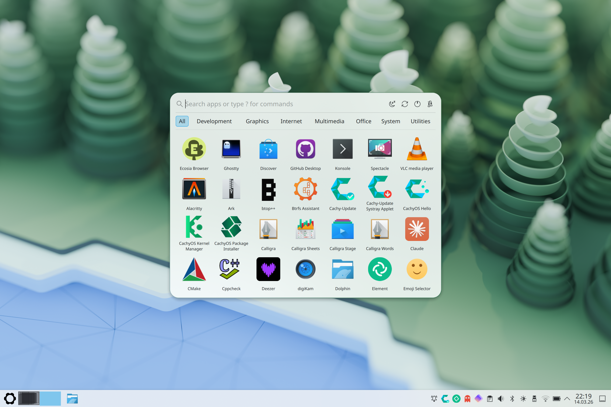
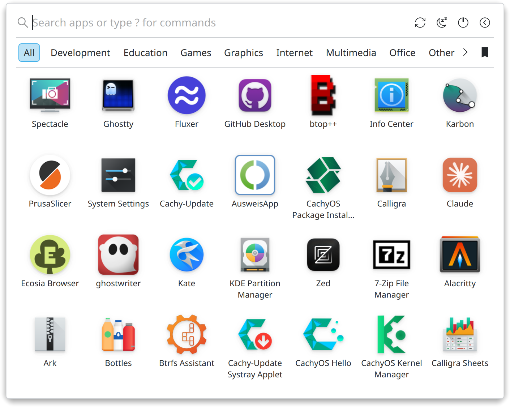
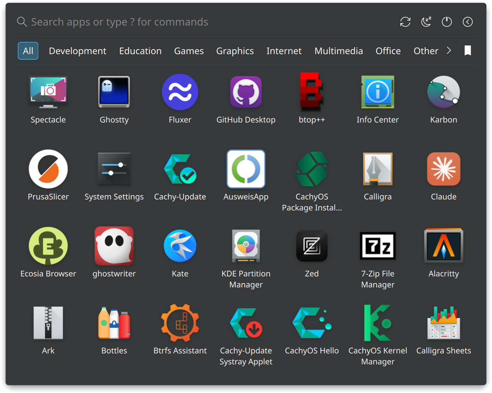
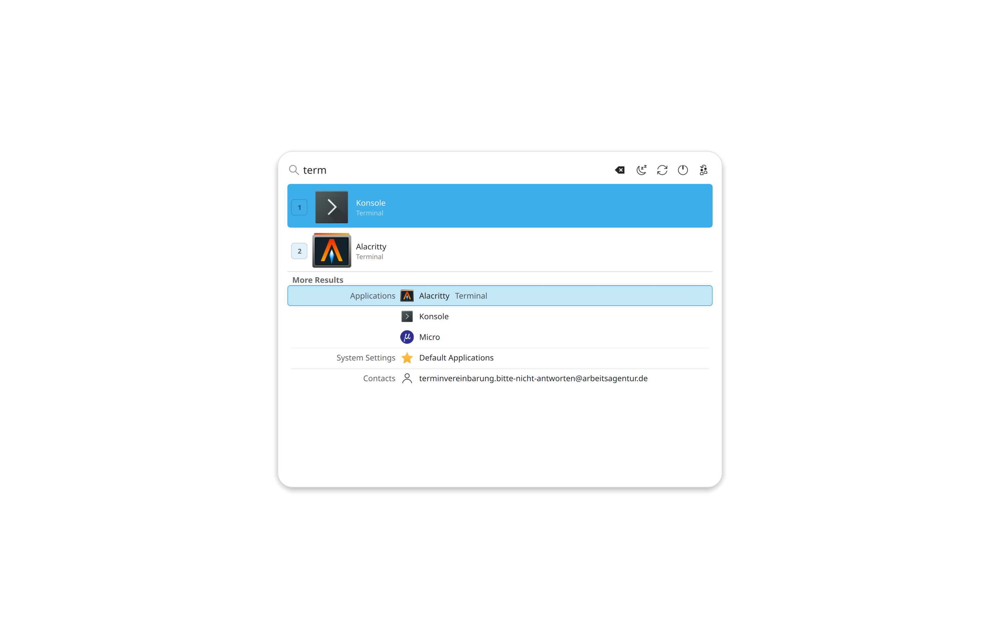
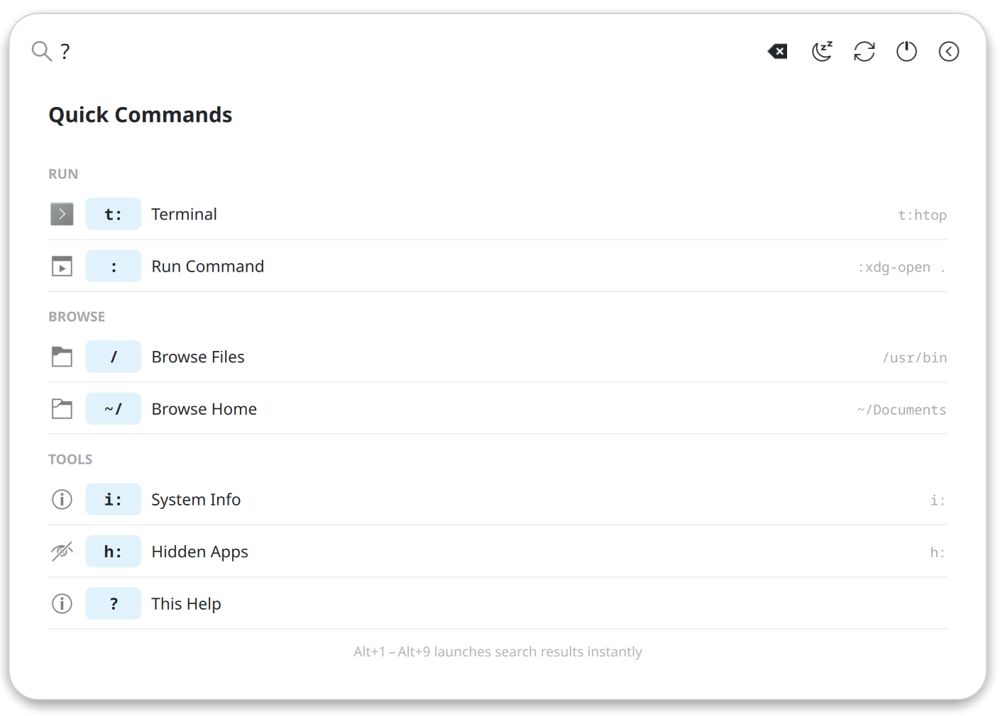
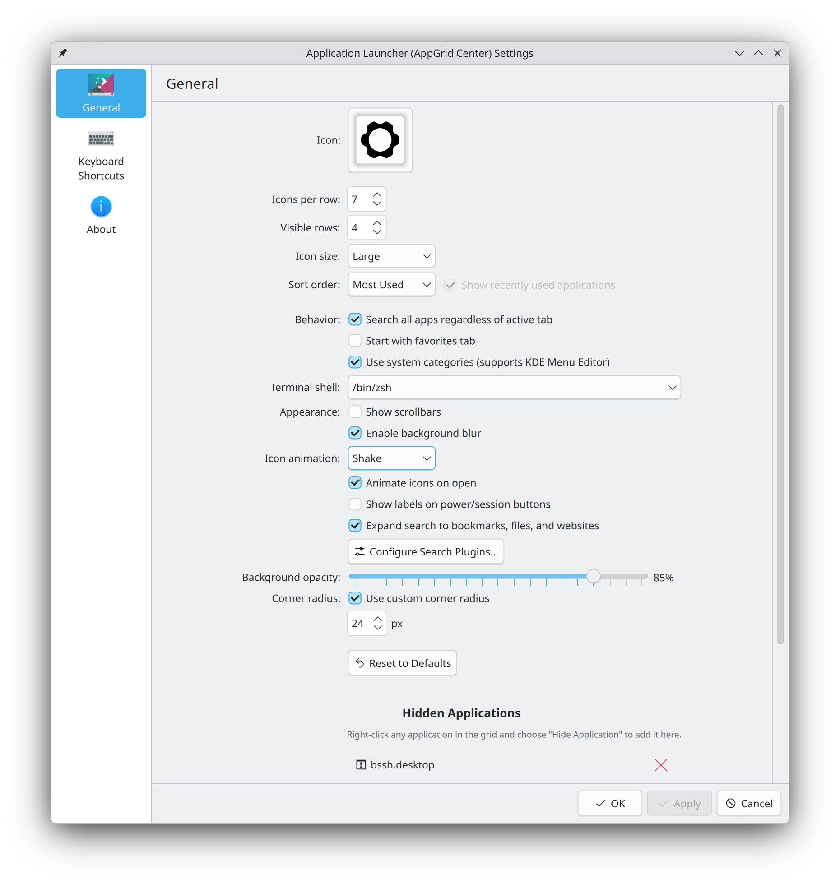

# AppGrid - KDE Plasma 6 Application Launcher

A modern application launcher for KDE Plasma, inspired by macOS Launchpad, COSMIC, and Pantheon.

AppGrid ships as two plasmoids that share a common codebase:

- **AppGrid** — a standalone window launcher with its own blur, opacity, and corner radius settings.
- **AppGrid (Panel)** — a native Plasma panel popup that opens anchored to the panel icon, just like Kickoff. For those who prefer the traditional style.

Both variants share the same app grid, search, categories, quick commands, and configuration — pick whichever fits your workflow. Requires version 1.2+.

> **Note:** AppGrid is actively maintained with a focus on stability, polish, and community-requested improvements. If you run into any issues, please [open an issue](https://github.com/xarbit/plasma6-applet-appgrid/issues) — you can type `i:` in the search bar to copy your system info for the report.

> **Compatibility:** AppGrid targets KDE Plasma 6 and supports a wide range of distributions. Multi-monitor screen selection works best with LayerShellQt 6.6+, but falls back to the older API on earlier versions. Pre-built packages are provided for Arch Linux (AUR), Fedora, openSUSE Tumbleweed, Ubuntu 25.04+, and Debian 13+.

> **Wayland-first:** AppGrid is developed and tested on Wayland. X11 support is included but less tested — the standalone launcher uses frameless window flags and manual screen positioning on X11 instead of LayerShellQt. The **AppGrid (Panel)** variant uses Plasma's native popup and works on both. If you encounter X11 issues, please [report them](https://github.com/xarbit/plasma6-applet-appgrid/issues).




## Why AppGrid?

KDE Plasma ships with Kickoff and Kicker as its default application launchers. While they are feature-rich, I find them difficult to navigate and slower to use for everyday app launching. I've always preferred the simplicity of how COSMIC, macOS Launchpad, and Pantheon handle application launching — a clean grid where everything is visible at a glance. Since nothing like that existed for Plasma, I decided to build one that fits my workflow.

## Screenshots











## Features

- **Two plasmoid variants** — standalone centered popup or native Plasma panel popup (like Kickoff)
- **Unified search** — app results and KRunner results merged into one list with Alt+1–9 shortcuts
- **Favorites** — add, remove, and reorder favorites with edit mode
- **Categories** — scrollable bar with Alt+key mnemonics, or use KDE Menu Editor categories
- **Application actions** — right-click any app to see jumplist actions (e.g., New Private Window)
- **Quick commands** — terminal (`t:`), shell commands (`:`), file browser (`/`), system info (`i:`), hidden apps manager (`h:`), help (`?`)
- **Keyword search** — matches desktop file keywords (e.g., typing "browser" finds Firefox)
- **Search ranking** — results ranked by match quality (name prefix > substring > generic name > keyword)
- **Multi-category** — apps appear in all matching categories, not just the first
- **By Category sort** — groups apps by category with section headers and scrollable navigation
- **Open/close animations** — Fade, Scale, Pop, Slide Up/Down, Glide, Buzz, Twist, Slam, or None
- **Icon animations** — shake, grow, bounce, spin, shuffle, or none
- **Multi-monitor** — open on active screen or panel screen
- **Customizable** — grid size, icon size, blur, opacity, corner radius, dividers, session buttons
- **Respects KDE settings** — system animation speed, font size, Plasma theme corner radius
- **Dim background** — optional darkened overlay behind the launcher for focus
- Sort by most used, alphabetically, or by category; new app detection with badge
- Context menu with favorites, pin to Task Manager, add to Desktop, hide apps
- Session management (sleep, restart, shut down, lock, log out, switch user)
- Drop-in replacement via Plasma's Show Alternatives

## Dependencies

### Runtime
- plasma-workspace
- kservice
- ki18n
- kio
- krunner
- layer-shell-qt

### Build
- cmake
- extra-cmake-modules
- qt6-base
- qt6-declarative
- libplasma
- kpackage
- kio
- kcoreaddons
- krunner
- kwindowsystem
- layer-shell-qt
- gettext

## Installation

### Pre-built packages

Pre-built packages for Fedora, openSUSE, Ubuntu, and Debian are available on the [Releases](https://github.com/xarbit/plasma6-applet-appgrid/releases) page. These are auto-generated and provided as is — I'm not a packager, and they may not follow all distro packaging standards. Ideally, distribution maintainers would pick up AppGrid for their official repositories. If you're a packager and want to maintain AppGrid for your distro, please reach out so I can link to your package and eventually retire these from the CI pipeline.

### Arch Linux (AUR) — officially supported

The AUR package is maintained by the author and is the only officially supported package at this time.

```bash
yay -S plasma6-applets-appgrid
```

## Building from source

```bash
cmake -B build -DCMAKE_BUILD_TYPE=Release -DCMAKE_INSTALL_PREFIX=/usr
cmake --build build -j$(nproc)
sudo cmake --install build
```

After installing, restart Plasma:

```bash
kquitapp6 plasmashell && kstart plasmashell
```

## Usage

1. Right-click your current application launcher in the panel
2. Select **Show Alternatives**
3. Choose **AppGrid**

Or add it as a new widget: right-click the panel → **Add Widgets** → search for **AppGrid**.

There are two variants:
- **AppGrid** — opens as a standalone window
- **AppGrid (Panel)** — opens as a native Plasma popup anchored to the panel icon, like Kickoff

### Keyboard shortcuts

| Key | Action |
|-----|--------|
| Super | Toggle AppGrid |
| Escape | Close |
| Enter | Launch top search result |
| Alt+1–9 | Launch numbered search result (apps and KRunner results) |
| Alt+letter | Jump to category by mnemonic |
| Arrow keys | Navigate results |
| Tab | Cycle through search results (apps + KRunner unified) |
| Type anywhere | Start searching |
| `t:command` | Run command in terminal |
| `:command` | Run shell command |
| `/path` or `~/path` | Browse files |
| `i:` | Show system info |
| `h:` | Manage hidden apps |
| `?` | Show quick commands help |

## Configuration

Right-click the AppGrid panel icon → **Configure AppGrid** → **General**.


| Setting | Description | Default |
|---------|-------------|---------|
| **Icon** | Panel icon or custom image | `start-here-kde-symbolic` |
| **Icons per row** | Number of columns in the grid (Center only) | 7 |
| **Visible rows** | Number of rows visible before scrolling (Center only) | 4 |
| **Icon size** | Small, medium, or large | Large |
| **Sort order** | Alphabetical, Most Used, or By Category | Most Used |
| **Open on active screen** | Open on mouse focus screen or panel screen | On |
| **Show category bar** | Show or hide the category filter bar | On |
| **Search all apps** | Search all apps regardless of active tab | On |
| **Start with favorites** | Open showing favorites instead of all apps | Off |
| **Use system categories** | Use KDE Menu Editor categories | Off |
| **Terminal shell** | Shell for `t:` commands | /bin/sh |
| **Show recently used** | Show recently used apps section | On |
| **Hide empty categories** | Hide categories with no apps | On |
| **Show divider lines** | Show dividers between UI sections | On |
| **Show scrollbars** | Show scrollbars in grid and search | Off |
| **Open/close animation** | None, Fade, Scale, Pop, Slide Up/Down, Glide, Buzz, Twist, Slam | Scale |
| **Enable background blur** | Blur behind the launcher (Center only) | On |
| **Dim background** | Darken the screen behind the launcher (Center only) | Off |
| **Icon animation** | None, Shake, Grow, Bounce, Spin, Shuffle | Shake |
| **Animate icons on open** | Play icon animation when launcher opens | On |
| **Show session buttons** | Show power/session buttons | On |
| **Show button labels** | Text labels on session buttons | Off |
| **KRunner plugins** | Search bookmarks, files, websites | On |
| **Background opacity** | Launcher background opacity (Center only) | 85% |
| **Corner radius** | Custom corner radius (Center only) | Off (uses Plasma theme) |

> **Note:** The **AppGrid Panel** variant shares most settings but does not include grid size, blur, opacity, corner radius, multi-monitor, or open/close animation — those are managed by Plasma's native popup. Settings marked **(Center only)** apply exclusively to the AppGrid Center variant.

## FAQ

**Why isn't there a `.plasmoid` file I can install from the KDE Store?**

AppGrid uses a C++ backend for app discovery, window management, blur effects, and session actions. The `.plasmoid` format only supports pure QML plasmoids — it has no mechanism to install the compiled plugin (`.so`) to the system plugin path where Plasma expects it. This is the same reason KDE's own C++ plasmoids (Kickoff, Kicker, etc.) are only distributed via system packages. AppGrid provides packages for Arch, Fedora, openSUSE, Ubuntu, and Debian.

**How do I reorder my favorites?**

Switch to the favorites tab, then click the edit button (pencil icon) in the bottom-right corner. Icons will start wiggling. Click an icon to select it, then click another to swap their positions. You can also remove favorites by clicking the remove button on each icon. Click the done button (checkmark). Your order is saved automatically.

**What are the two category modes?**

By default, AppGrid uses a simplified built-in category mapping that groups apps into clean categories like Development, Graphics, Internet, Multimedia, Office, System, and Utilities. If you enable "Use system categories" in settings, AppGrid reads categories directly from the KDE menu system. This respects any changes made in KDE Menu Editor — you can rename, reorganize, or create custom categories and AppGrid will reflect them automatically. Right-click any category to open the Menu Editor.

## Credits

- **Jason Scurtu** — Author
- **[@claude](https://github.com/claude)** — AI pair programming assistant

Disclaimer:
This project uses [Claude Code](https://claude.ai/claude-code) as an AI pair programmer and AI assistant. To be clear: this is **not** vibe-coded — it is context engineered and reviewed. Nevertheless, if AI-assisted code gives you the ick, this might not be the launcher for you.

## Contributing

Contributions are welcome! Here's how you can help:

- **Bug reports** — [open an issue](https://github.com/xarbit/plasma6-applet-appgrid/issues) with steps to reproduce, your Plasma version, and any relevant screenshots
- **Translations** — translation files are in `po/`. Add or improve translations for your language and submit a pull request
- **Packaging** — if you maintain packages for a Linux distribution and want to package AppGrid, please reach out
- **Code** — fork the repo, create a feature branch, and submit a pull request. Please keep changes focused and test on both plasmoid variants (AppGrid Center and AppGrid Panel)

## License

GPL-2.0-or-later
